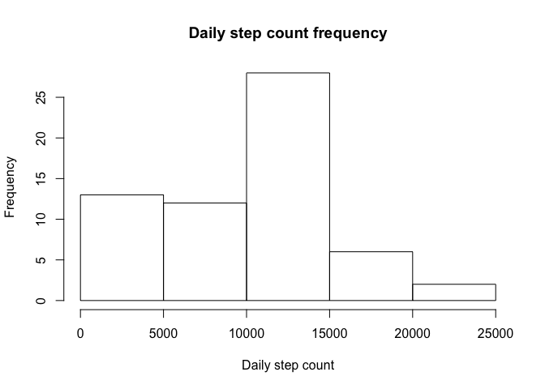

## Loading and preprocessing the data


```r
activity <- read.csv('activity.csv')
library(dplyr)
```

```
## 
## Attaching package: 'dplyr'
```

```
## The following objects are masked from 'package:stats':
## 
##     filter, lag
```

```
## The following objects are masked from 'package:base':
## 
##     intersect, setdiff, setequal, union
```

```r
acvitity <- tbl_df(activity)
```

## What is mean total number of steps taken per day?

First calculate total number of steps per day, then take the mean.


```r
daily_steps <- activity %>% group_by(date) %>% summarize(daily_steps=sum(steps, na.rm=TRUE))
hist(daily_steps$daily_steps, main="Daily step count frequency", xlab = "Daily step count")
```

<!-- -->

```r
daily_steps %>% summarize(avg=mean(daily_steps, na.rm=TRUE))
```

```
## # A tibble: 1 x 1
##     avg
##   <dbl>
## 1 9354.
```

## What is the average daily activity pattern?

First calculate average steps per interval across all days, then plot.


```r
interval_means <- activity %>% group_by(interval) %>% summarize(interval_mean=mean(steps, na.rm=TRUE))
plot(interval_means$interval_mean, type="l", main="Average daily step count pattern", xlab="Interval", ylab="Average steps")
```

<!-- -->

## Imputing missing values

How many missing values are there?

```r
sum(is.na(activity$steps))
```

```
## [1] 2304
```

Imputing missing values with the mean of the same 5-minute interval across all other days.

```r
activity_imputed <- activity
activity_imputed$steps[is.na(activity_imputed$steps)] <- 
  (activity %>% filter(is.na(steps))
            %>% group_by(interval)
            %>% mutate(steps = rep(interval_means$interval_mean[interval_means$interval==interval[1]], length(interval))))$steps
```

New histogram of daily steps:

```r
daily_steps_imputed <- activity_imputed %>% group_by(date) %>% summarize(daily_steps=sum(steps))
hist(daily_steps_imputed$daily_steps, main="Daily step count frequency (Imputed)", xlab = "Daily step count")
```

<!-- -->

Compare mean/median of before vs. after imputing:

```r
summary(daily_steps$daily_steps)
```

```
##    Min. 1st Qu.  Median    Mean 3rd Qu.    Max. 
##       0    6778   10395    9354   12811   21194
```

```r
summary(daily_steps_imputed$daily_steps)
```

```
##    Min. 1st Qu.  Median    Mean 3rd Qu.    Max. 
##      41    9819   10766   10766   12811   21194
```

As can be seen, most values rose slightly because the original NAs dragged down the values previously (e.g. min was 0 before).

## Are there differences in activity patterns between weekdays and weekends?

Add a `isWeekend` factor to the imputed activity dataset:

```r
activity_imputed <- activity_imputed %>% mutate(isWeekend = weekdays(as.Date(as.character(activity_imputed$date))) %in% c("Saturday", "Sunday")) %>% mutate_if(is.logical, as.factor)
```

Calculate activity patterns for weekdays vs. weekends:

```r
weekend_interval_means <- activity_imputed %>% filter(isWeekend == TRUE) %>% group_by(interval) %>% summarize(interval_mean=mean(steps, na.rm=TRUE))
weekday_interval_means <- activity_imputed %>% filter(isWeekend == FALSE) %>% group_by(interval) %>% summarize(interval_mean=mean(steps, na.rm=TRUE))
```

Plot them side-by-side:

```r
par(mfrow=c(2,1),mar=c(2,4,1,1))
plot(weekend_interval_means$interval_mean, type="l", main="Weekend", xlab="Interval", ylab="Average steps")
plot(weekday_interval_means$interval_mean, type="l", main="Weekday", xlab="Interval", ylab="Average steps")
```

<!-- -->
